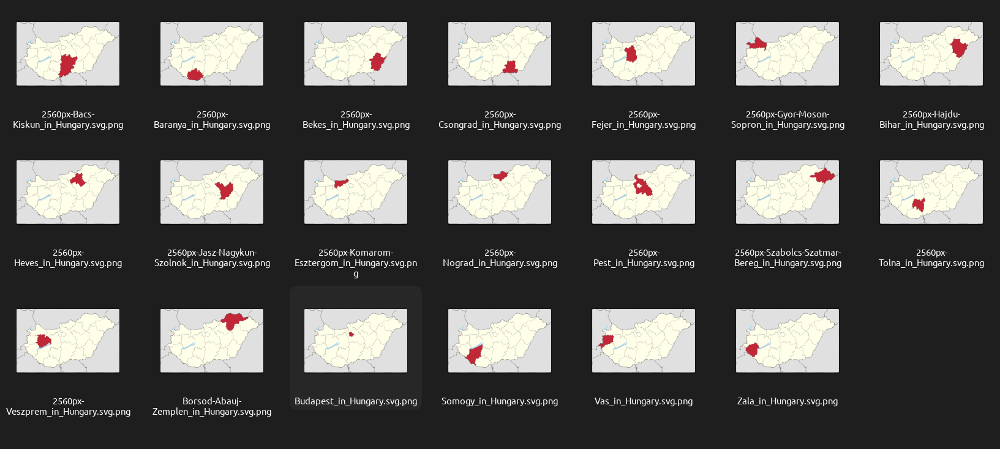
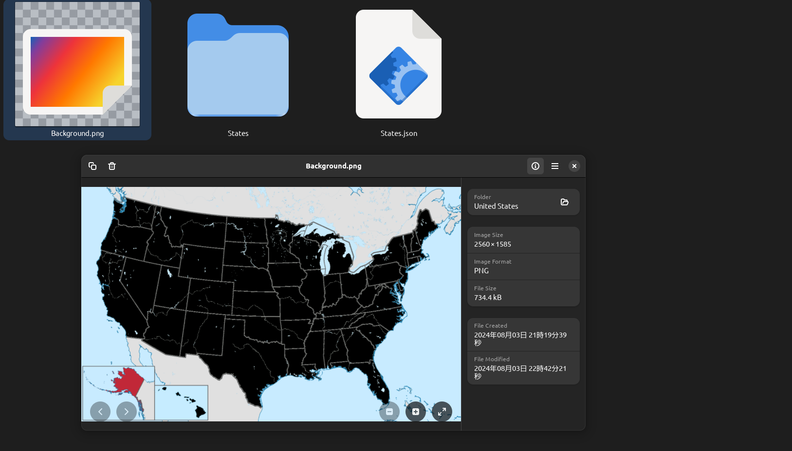
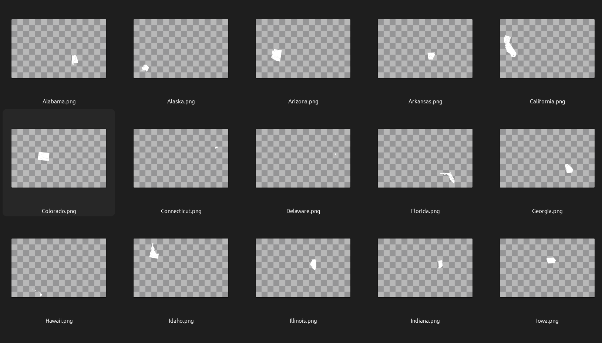

# Generate Blankmaps
This library automates the generation of blank maps in the format required by [Blankmap Studio](https://github.com/anderudp/BlankmapStudio). It uses Numba to accelerate image processing on CUDA-capable machines.

## Usage
### 1. Collect PNG locator maps of matching resolution for the desired region into an arbitrary folder


The script is largely pre-configured for the locator map scheme published on Wikimedia Commons, such as [these ones for the United States](https://commons.wikimedia.org/wiki/Category:SVG_locator_maps_of_states_of_the_United_States_(location_map_scheme)). 

### 2. Clone this repository into the folder
```bash
cd <your folder>
git clone https://github.com/anderudp/GenerateBlankmaps
```

### 3. Configure `generate_blankmap.py` to your needs
```python
# Name of the city/country/continent being processed
superregion = "United States"

# Type of area being processed (i.e. Districts, Counties, Prefectures, etc.)
area_type = "States"  

# Auto-remove undesired artifacts from Wikimedia Commons' naming scheme
remove_from_filename = ["2560px-", "_in_United_States.svg"]

# Color of the selected area on the locator maps
area_color = np.array((193, 39, 55)).astype(np.uint8)

# Color of other areas on the locator maps
bg_filtered_color = np.array((254, 254, 233)).astype(np.uint8)

# Set lower if too many artifacts on either the background or areas
area_threshold = 2
bg_threshold = 10
```

### 4. Install dependencies
You will need to install some dependencies for the script to work. If you choose to skip creating a virtual environment, keep in mind that Numba might still be dependent on Numpy v1. If your global Python context has v2 installed, the script will not run.
```bash
cd <your folder>
python3 -m venv ./venv
source venv/bin/activate
pip install -r requirements.txt
```

### 5. Run `generate_blankmap.py`
```bash
python3 generate_blankmap.py
```

In the freshly generated superregion folder you should be seeing something like this:


And the subregion folder should contain the filtered areas like this:



### 6. Move the superregion folder into Blankmap Studio's Assets/Resources folder
Once added, the Unity Editor should automatically generate any meta files needed for immediate play the next time you load it. Enjoy your new map!